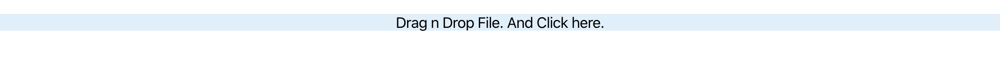
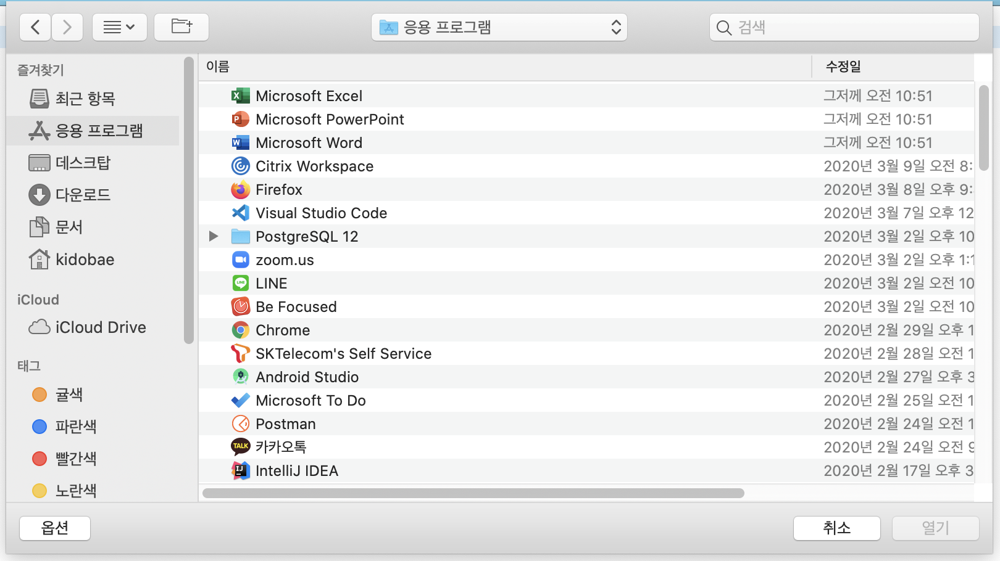
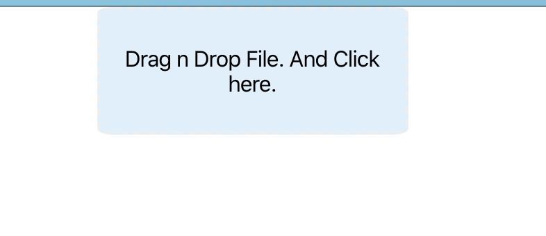
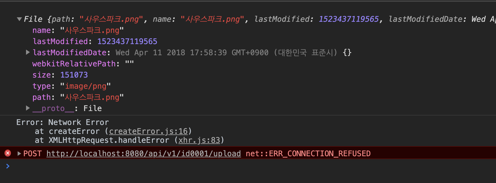

# DropZone 으로 파일 드래그앤 드롭 사용하기. 

DropZone 라는 오픈소스를 이용하면 드래그앤 드롭으로 파일 처리를 할 수 있습니다. 

그 중에서 우리는 react 를 이용하여 DropZone 을 이용하기 때문에 react-dropzone 오픈소스를 이용할 예정입니다. 

## react application 생성하기. 

우선 react application 생성하겠습니다. 

```
npx create-react-app drop-zone-test 
```

위 명령을 실행하여 프로젝트를 생성합니다. 

다음 명령으로 정상적으로 생성되었는지 확인합니다. 

```
cd drop-zone-test

npm start
```

## react-dropzone 모듈 설치하기. 

이제 dropzone 모듈을 설치할 차례입니다. 

```
npm install -S react-dropzone
```

설치가 완료 되었습니다 .

## dropzone 사용하기. 

이제 해당 사이트에서 어떻게 사용하는지 확인해 보겠습니다. 

https://github.com/react-dropzone/react-dropzone/ 에서 dropzone 사용법을 확인하면 다음과 같습니다 .

```
import React, {useCallback} from 'react'
import {useDropzone} from 'react-dropzone'

function MyDropzone() {
  const onDrop = useCallback(acceptedFiles => {
    // Do something with the files
  }, [])
  const {getRootProps, getInputProps, isDragActive} = useDropzone({onDrop})

  return (
    <div {...getRootProps()}>
      <input {...getInputProps()} />
      {
        isDragActive ?
          <p>Drop the files here ...</p> :
          <p>Drag 'n' drop some files here, or click to select files</p>
      }
    </div>
  )
}
```

위 코드를 이용하면 dropzone 을 사용할 수 있습니다. 

## axios 모듈 설치하기

파일을 서버로 전달하기 위해서 axios 를 설치합니다. 

```
npm install -S axios
```

## 파일업로드 컴포넌트 만들기. 

우리는 파일을 드롭다운 하면 서버로 파일 업로드를 지원하기 위해서 컴포넌트를 별도로 하나 만들겠습니다. 

**FileDropAndUpload.js** 파일을 만들고 다음과 같이 작성해줍니다. 

참고로 dropzone 모듈은 react hooks 를 이용하여 개발이 되어 있으므로, react 버젼이 react hooks 를 지원해야합니다. 

버젼 16.8 이상 버젼을 사용해야합니다. 

```
import React, {useCallback} from 'react';
import Dropzone, {useDropzone} from 'react-dropzone';
import axios from 'axios';
import './FileDropAndUpload.css';

const FileUploadZone = (props) => {
    return (
        <div className="fileUploadZone" style={{background:props.background}}>
            <FileDropZone {...props}/>
        </div>
    );
}
```

이 코드는 우리가 만들 컴포넌트 이름입니다. 

```
<FileDropZone {...props}/>
```

FileDropZone 은 드롭존 컴포넌트를 하나 만들고, 전달받은 props 를 다시 컴포넌트로 전달합니다. 

그리고 dropzone 소스를 다음과 같이 추가합니다.

```
function FileDropZone({fileUploadUrl, description, elseDescription}) {
    const onDrop = useCallback(acceptedFiles => {
      // 드롭다운된 파일 정보를 확인할 수 있습니다. 
      const file = acceptedFiles[0];
      console.log(file);

      // 파일 업로드를 위해서 폼 데이터를 만들어 줍니다. 
      // 파일은 멀티파트 폼으로 전달됩니다. 
      const formData = new FormData();
      formData.append("file", file);
      
      axios.post(fileUploadUrl,
          formData, 
          {
            headers: {
              "Content-Type":"multipart/form-data"
            }
          }
      ).then(() => {console.log("File uploaded successfully")})
      .catch(err => {
        console.log(err);
      })
    }, [])
    const {getRootProps, getInputProps, isDragActive} = useDropzone({onDrop})
  
    return (
      <div {...getRootProps()}>
        <input {...getInputProps()} />
        { isDragActive ? (<p>{description}</p>) : (
            <p>{elseDescription}</p>
        )
        }
      </div>
    )
  }
```

위 코드가 익숙하죠? 처음 우리가 react-dropzone 에 대한 소스에서 팡리 업로드를 이용하기 위한 코드만 추가해 주었습니다. 

```
...
      // Do something with the files
      const file = acceptedFiles[0];
      console.log(file);

      const formData = new FormData();
      formData.append("file", file);
      
      axios.post(fileUploadUrl,
          formData, 
          {
            headers: {
              "Content-Type":"multipart/form-data"
            }
          }
      ).then(() => {console.log("File uploaded successfully")})
      .catch(err => {
        console.log(err);
      })
...      
```

이 코드가 우리가 추가한 코드입니다. 

axios 를 이용하여 외부 컴포넌트에서 전달받을 fileUploadUrl 을 타겟 url로 지정했고, 폼 데이터와 헤더를 추가하여 파일 업로드 형태로 전달합니다. 

fileUploadUrl 에 적절한 서버 API 가 필요합니다. 이 부분은 추가적인 아티클로 구현해 보겠습니다. 

마지막으로 우리 컴포넌트를 외부로 노출합니다. 

```
export default FileUploadZone;
```

## 컴포넌트 사용하기. 

우리가 만든 컴포넌트가 받을 파라미터 형태를 우선확인해 보겠습니다. 

```
  {
    fileUploadUrl: `http://localhost:8080/api/v1/${userId}/upload`, 
    description: 'Drag n Drop File here',
    elseDescription: 'Drag n Drop File. And Click here.',
    background: '#deeffc'
  }
```

우리는 위와 같은 형태의 객체를 파라미터로 전달합니다. 

우선 파일 업로드할 서버 API 경로, 드래그앤드롭 영역 이름 (description, elseDescription) 입니다. 그리고 영역의 색상을 지정하기 위해서 background 도 지정해 주었습니다. 

App.js 파일을 다음과 같이 수정해주세요. 

```
import React from 'react';
import logo from './logo.svg';
import './App.css';
import FileDropAndUpload from './FileDropAndUpload';

function App() {
  let userId = 'id0001';
  let fileUploadInfo = {
    fileUploadUrl: `http://localhost:8080/api/v1/${userId}/upload`, 
    description: 'Drag n Drop File here',
    elseDescription: 'Drag n Drop File. And Click here.',
    background: '#deeffc'
  }
  return (
    <div className="App">
      <FileDropAndUpload {...fileUploadInfo}/>
    </div>
  );
}

export default App;
```

FileDropAndUpload 컴포넌트에 파라미터를 전달하는 부분을 확인해주세요. 

이제 결과를 한번 확인해보겠습니다. 

```
npm start
```

http://localhost:3000 을 확인해보면 다음과 같이 보입니다. 



모양은 별로 안으쁘지만 우리가 원하는 형태로 변경 되었습니다. 

클릭해보면 아래와 같이 나타납니다. 



잘 작동이 되네요. 

## 모양 내기. 

어딘가 모양이 안이쁩니다. 

조금 손질을 쩜 해보겠습니다. 

FileDropAndUpload.css 파일을 하나 만들고 다음 코드를 작성해 줍니다. 

```
div.fileUploadZone {
  margin: 0 auto;
  padding: 10px;
  width: 200px;
  border-radius: 5%;
  border: 2px dashed #eee;
  cursor: grab;
}
```



그나마 약간 좋아보입니다. 

이래서 디자이너가 필요한거 같네요. ^^

## 드롭다운시 콘솔 확인하기

드롭다운 되었을때 콘솔을 확인해 보겠습니다. 

파일을 지정된 영역으로 드롭다운 하면 다음과 같은 콘솔 정보를 확인할 수 있습니다. 



## 결과

지금까지 react-dropzone 을 이용하여 컴포넌트를 만들어 보았습니다. 

역시 dropzone 은 정말 멋진 오픈소스인거 같습니다. 


